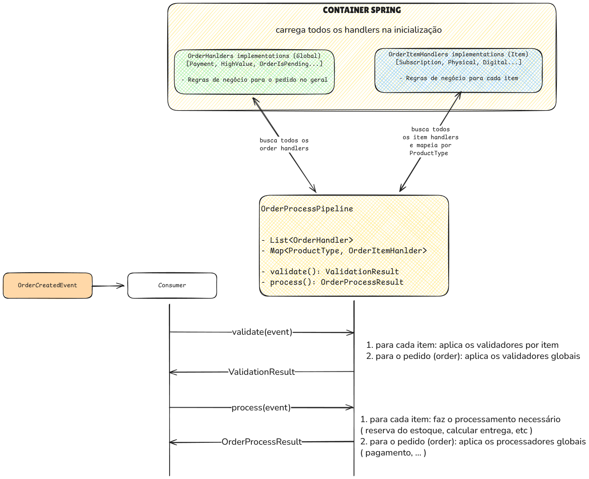

# ADR 0004: Handler Pattern para Validação e Processamento

## Status

Aceito

## Contexto

O sistema precisa processar diferentes tipos de produtos com regras específicas de validação e processamento. A solução deve ser extensível, seguindo SOLID e Design Patterns.

## Decisão

Implementar padrão de estratégias modular (Strategy Pattern) com handlers que seguem contratos (interfaces):

### Interfaces Principais

- **`OrderHandler`**: handlers globais que processam e validam o pedido completo, aplicando validações e processamentos independentes dos itens específicos
- **`OrderItemHandler`**: handlers específicos que processam e validam cada item, por tipo de produto, declarando suporte via método `supportedType()`

### Fluxo

```
pedido criado → consumer recebe evento → pipeline de validação → pipeline de processamento → marca como completo (ou erro)
```



### Extensibilidade

Para adicionar nova regra de validação ou processamento, basta criar nova classe implementando a interface apropriada. O Spring injeta automaticamente.

## Alternativas Consideradas

Implementação com lista de handlers por tipo de pedido, onde um handler poderia lidar com múltiplos tipos. Descartada devido à complexidade de orquestração (ex: handler de pagamento poderia agir antes do de validação).

## Consequências

### Positivas

- Modularidade: cada handler é uma "peça de lego"
- Extensibilidade: adicionar/remover sem alterar comportamento existente
- Injeção automática via Spring
- Separação clara de responsabilidades

### Negativas

- Padrão mais simples pode ter limitações para casos complexos de orquestração
- Possível violação do princípio de Responsabilidade Única (SRP) em alguns handlers

